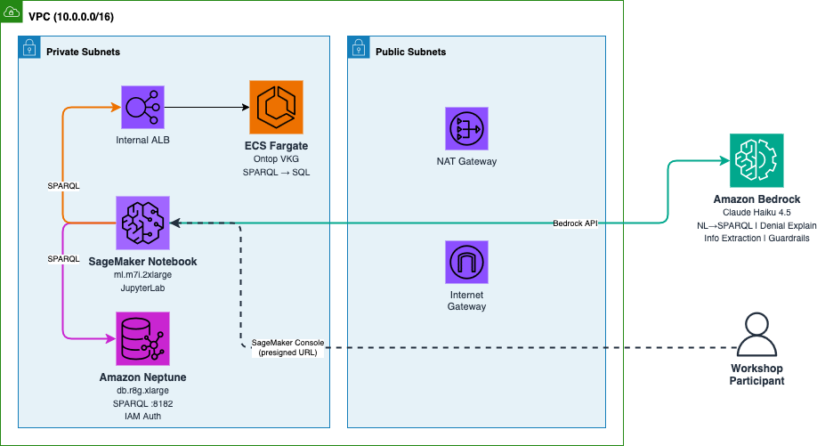

# Ontology as a Semantic Layer for Agentic AI Applications

Hands-on workshop demonstrating how ontology-based semantic layers provide structure, reasoning, and explainability for AI applications using Amazon Neptune and Amazon Bedrock.

## Architecture



## Prerequisites

- An AWS account with permissions to create Neptune, SageMaker, ECS, and Bedrock resources
- AWS CLI configured with valid credentials
- Amazon Bedrock model access enabled for Claude Haiku 4.5 in us-east-1

## Deployment

### Step 1: Upload VKG dependencies to S3

The Ontop Virtual Knowledge Graph container requires the Ontop CLI and H2 JDBC driver. Download these and upload to an S3 bucket:

```bash
# Create an S3 bucket for workshop assets
aws s3 mb s3://your-workshop-assets-bucket --region us-east-1

# Download Ontop CLI and H2 driver
curl -sL "https://github.com/ontop/ontop/releases/download/ontop-5.2.0/ontop-cli-5.2.0.zip" -o ontop-cli.zip
curl -sL "https://repo1.maven.org/maven2/com/h2database/h2/2.2.224/h2-2.2.224.jar" -o h2.jar

# Upload everything
aws s3 cp vkg/ s3://your-workshop-assets-bucket/static/vkg/ --recursive
aws s3 cp ontop-cli.zip s3://your-workshop-assets-bucket/static/vkg/
aws s3 cp h2.jar s3://your-workshop-assets-bucket/static/vkg/
aws s3 cp notebooks/ s3://your-workshop-assets-bucket/static/notebook/ --recursive
```

### Step 2: Deploy the CloudFormation stack

```bash
aws cloudformation create-stack \
  --stack-name semantic-layer-workshop \
  --template-body file://cloudformation/semantic-layer-workshop.yaml \
  --parameters \
    ParameterKey=MyAssetsBucketName,ParameterValue=your-workshop-assets-bucket \
    ParameterKey=MyAssetsBucketPrefix,ParameterValue="" \
  --capabilities CAPABILITY_IAM \
  --region us-east-1
```

The stack takes approximately 15-20 minutes to deploy. It creates:

- **Amazon Neptune** (db.r8g.xlarge) - RDF graph database with IAM auth
- **ECS Fargate** - Ontop VKG container behind an internal ALB
- **SageMaker Notebook** (ml.m7i.2xlarge) - JupyterLab with pre-installed dependencies
- **VPC** - 2 AZs, private subnets, NAT Gateway

### Step 3: Access the notebook

1. In the CloudFormation console, go to the stack's **Outputs** tab
2. Click the **NotebookUrl** link to open the SageMaker console
3. Click **Open JupyterLab** (not classic Jupyter)
4. Navigate to `semantic-layer-workshop/` and start with notebook `01`

## Workshop Notebooks

| Notebook | Title | Duration |
|----------|-------|----------|
| 01 | From Source Metadata to Ontology | 15 min |
| 02 | RDF Data and SHACL Validation | 20 min |
| 03 | Loading the Knowledge Graph into Neptune | 15 min |
| 04 | The Virtual Knowledge Graph (Ontop) | 15 min |
| 05 | Natural Language to SPARQL | 15 min |
| 06 | Explaining Denied Claims | 20 min |
| 07 | Information Extraction | 15 min |
| 08 | Agent Guardrails - SHACL Steering Hooks | 15 min |

## Cleanup

```bash
aws cloudformation delete-stack --stack-name semantic-layer-workshop --region us-east-1
```

## Cost

Approximate cost while running: **$5-8 per hour**. Delete the stack when finished.

| Resource | Approximate Cost |
|----------|-----------------|
| Neptune (db.r8g.xlarge) | ~$1.57/hour |
| SageMaker Notebook (ml.m7i.2xlarge) | ~$0.58/hour |
| ECS Fargate (Ontop VKG) | ~$0.05/hour |
| NAT Gateway | ~$0.05/hour |

## License

This library is licensed under the MIT-0 License. See the [LICENSE](../../LICENSE) file.
